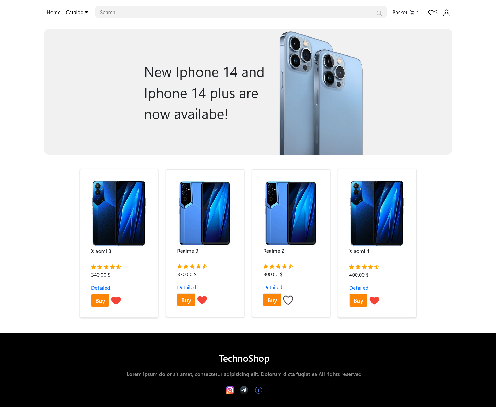
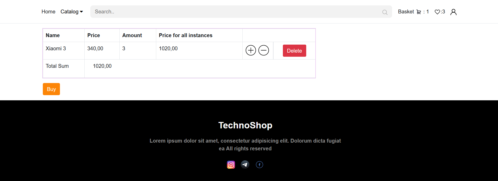
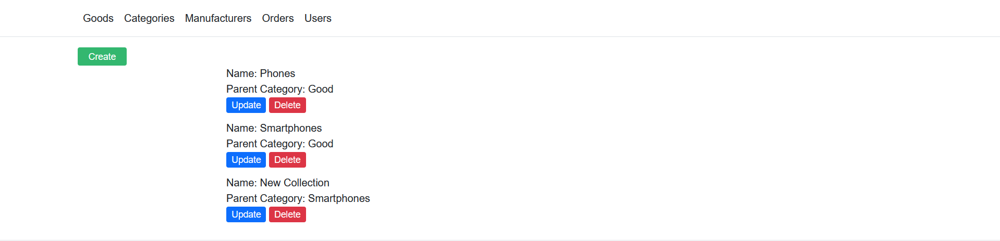
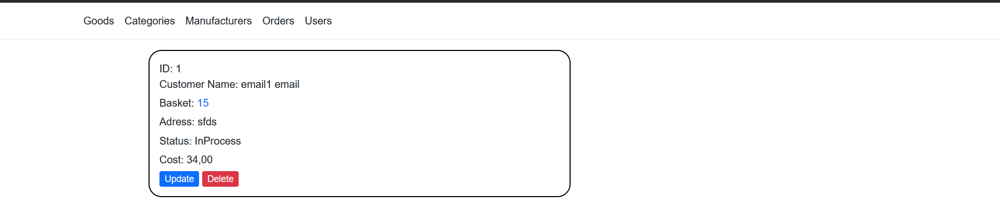
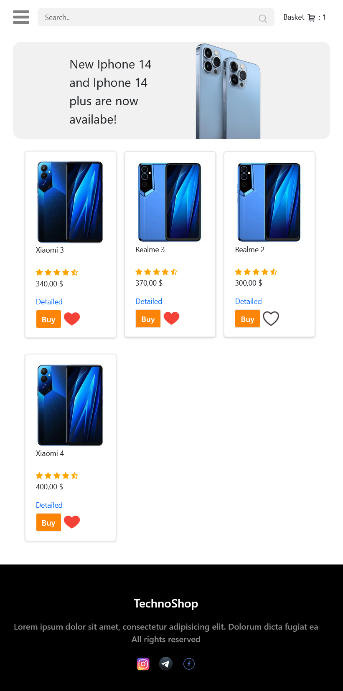
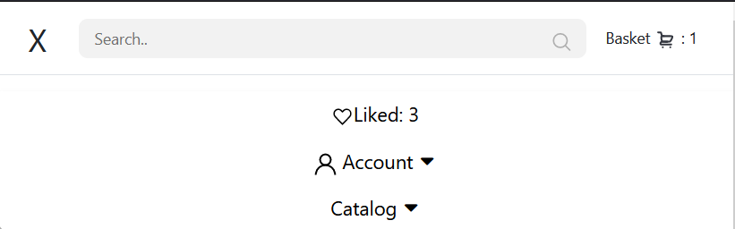

Website for online  shop with versions for customer account and separate admin panel for elastic management. This site was made with adaptive frontend and has mobile version.
Users can view Catalog, read more details about selected product, get it to basket and then make an order with information about delivery. Customers also can like selected product and view them in separate Liked List.
Admins can edit information about products, categories, view orders and mark them as delivered.

FRONTEND: Html, css, vanila js, jQuery.

BACKEND: .Net, EntityFramework, MySQL, ASP.NET, MVC, xUnit.

<h3> Adding new product to basket </h3>

## ADMIN PANEL

<h3> Viewing existing users </h3>

## MOBILE VERSION

<h3>Menu unwrapped</h3>

